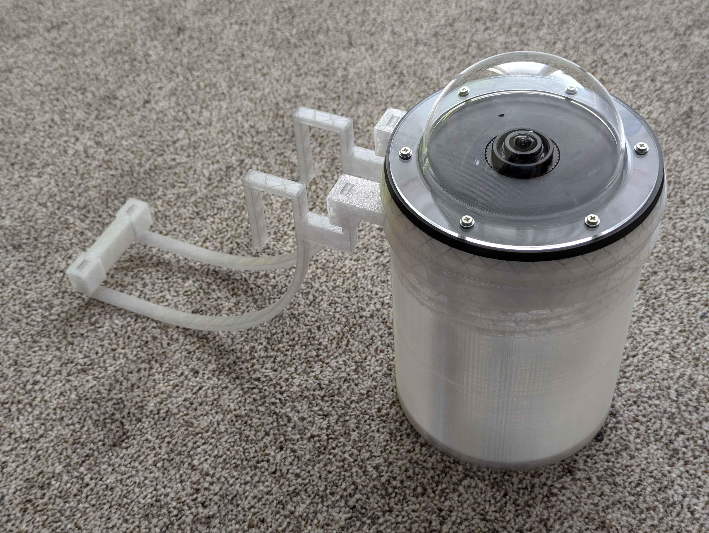

# Allsky camera housing

This is a model of a housing for an all sky camera project [https://github.com/AllskyTeam/allsky](https://github.com/AllskyTeam/allsky), using a RaspberryPi HQ Camera.

My version uses Arducam's 1.56mm f/2 fish eye lens (with cca 180° FOV), if you wish to have a more narrow field of view, you can choose a different one.

The model should provide a good weather proofing of the RPi inside, as well as of the camera module. For the construction you will need to buy a 10cm acrylic dome with a lip (this one works well enough [https://www.amazon.de/-/de/dp/B09B8BR5C5](https://www.amazon.de/-/de/dp/B09B8BR5C5)) and drill 6 holes in it, then fix it to the top part with silicone and M3 / M2.5 screws with nuts (or use more heat inserts). The camera module itself is held in place using M2.5x4x4 heat inserts and screws, which allows for easy removal and refocusing.

To edit the OpenSCAD files, you will need to have [PiHoles.scad](https://github.com/daprice/PiHoles) and [BOSL](https://github.com/revarbat/BOSL) libraries installed.

My version is getting power by a PoE cable (with one PoE injector, and one PoE splitter) with a modified USB micro connector at the end of it (simply connect the red&black wires of the USB with the PoE wires).

## A simple guide for modifications:
the main OpenSCAD file (allsky.scad) has several objects:

- `AllSkyHousing();` → this creates the top part of the housing, that attaches to the acrylic dome and camera
- `enclosure();` → generates an enclosure for the raspberry pi and all the cables (the part with 3 holes in the bottom of it)
 
If you wish to modify any of the measurements, i reccomend you start looking from these lines.

2D profiles for test fitting can be found attached at the releases tab, or you can export one yourself by running a `projection()` command.

# Update 03-03-25:

I have added a mount for this all sky camera enclosure, if wish want to hang yours by a drainpipe, you can print an additional mounting ring, that goes between the top and bottom part of the enclosure. Then, you will need to print both mounting arms (or hooks), which you will then attach to the mounting ring (use 2 connectors for better support, but one on the lower end should be sufficient):



You will probably need to adjust the measurements of the individual arms, you can do so by opening `allsky_mount.scad` in OpenSCAD and moving sliders in the customizer window on the right side.
After this, you can hang the whole contraption on a drain pipe, and it should stay fixed quite snuggly.

I added the needed mounting ring to the `allsky.scad` file, it is generated by two lines of code:

```scad
	hooks();
	ring(50);
```